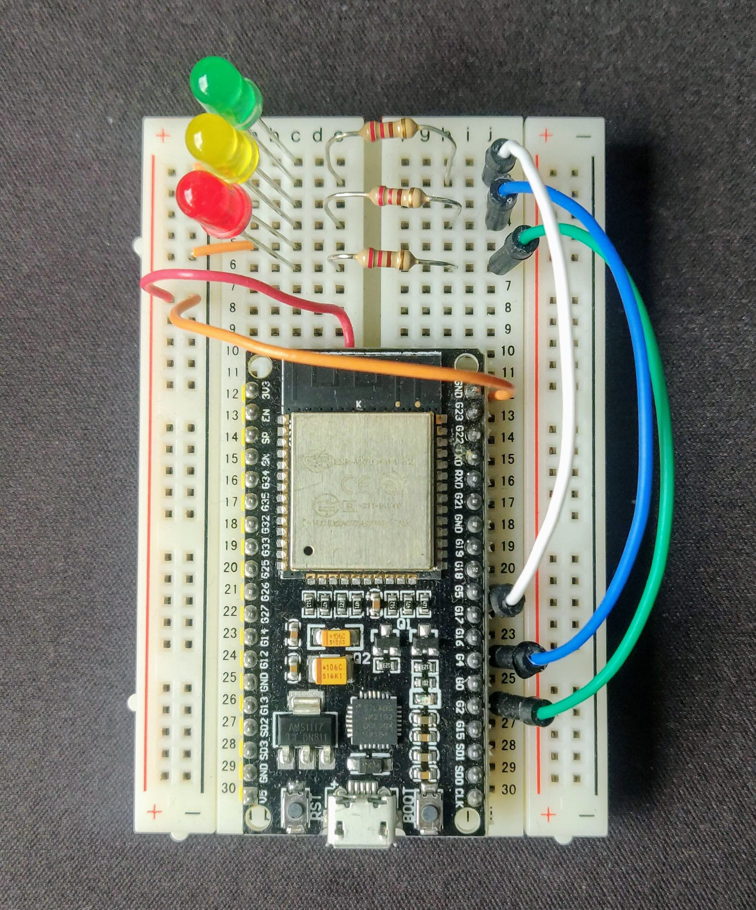

# Introduction
In this repository we'll create all elements required to receive your cloudwatch alarms ont you ESP device and get the LED notifications
The flow chain will be: 
```
Cloudwatch Alarm > SNS Topic > Lambda > MQTT > IOT Device
```
***

First you'll need to clone this repo :
```
git clone <this repo>
```

# ESP cabling
```
ledRed => G2;
ledYellow => G4;
ledGreen => G5;
```



# IOT Configuration
Before starting to code the function for our ESP32 we'll create the elements on the AWS side.

## Create the thing in AWS
To be able to send data to your ESP your first need to declare it to IOT Core. 
You can do this using the console, IaC or the AWS CLI as describe below : 

```
# name of the IoT Device Thing
# change this to what you want
THING_NAME=script_test
 
# create the thing
aws iot create-thing --thing-name ${THING_NAME} | tee outputs/create-thing.json
 
# create and download the keys and device certificate
aws iot create-keys-and-certificate --certificate-pem-outfile outputs/certificates/${THING_NAME}-certificate.pem.crt --public-key-outfile outputs/certificates/${THING_NAME}-public.pem.key --private-key-outfile outputs/certificates/${THING_NAME}-private.pem.key --set-as-active | tee outputs/create-keys-and-certificate.json
 
# create the thing policy
aws iot create-policy --policy-name ${THING_NAME}_all_access --policy-document '{"Version": "2012-10-17", "Statement": [{"Effect": "Allow", "Action": ["iot:*"], "Resource": ["*"]}]}'
 
# Retrieve Cert ARN
CERT_ARN=$(jq -r '.certificateArn' < outputs/create-keys-and-certificate.json)

# attach the certificate to the thing
aws iot attach-thing-principal --thing-name ${THING_NAME} --principal ${CERT_ARN}
 
# attach policy to the certificate
aws iot attach-policy --policy-name ${THING_NAME}_all_access --target ${CERT_ARN}
 
# download the amazon root ca
wget https://www.amazontrust.com/repository/AmazonRootCA1.pem
# or on mac
curl  https://www.amazontrust.com/repository/AmazonRootCA1.pem > outputs/certificates/AmazonRootCA1.pem
 
# find out what endpoint we need to connect to
aws iot describe-endpoint --endpoint-type iot:Data-ATS | tee outputs/describe-endpoint.json

```
Thanks to https://gist.github.com/noahcoad/d2ac692b487200559a6a0a0b8762a690

Test if your IOT device has been properly declared : 
```
aws iot list-things
```

Of course you can also browse the AWS Console in IOT Core to see your device configuration.

Now that we have the our IOT device create on AWS we can continue with the code we'll push to our ESP32

## ESP32 Source code
### Create the certificate files

```
cd src_esp
cp template_certs.h certs.h
cp template_patrameters.h parameters.h
``` 

Update the parameters.h file with your parameters
- Your wifi SSID (2.4Ghz only)
- Your Wifi Password
- The IOT Endpoint can be found in outputs/describe-endpoint.json
- The IOT MQTT Topic to subscribe to.

Update the certs.h file with your parameters
- AWS_PUBLIC_CERT is outputs/certificates/AmazonRootCA1.pem content
- AWS_DEVICE_CERT is outputs/certificates/${THING_NAME}-certificate.pem.crt content
- AWS_PRIVATE_KEY is outputs/certificates/${THING_NAME}-private.pem.key content

## src_esp/src_esp.ino content
The src_esp.ino does not have to be touched

# Complile and push


### Tests

```
aws iot-data publish --topic alarm_reader/device01/sub  --payload fileb://test_ok.json
aws iot-data publish --topic alarm_reader/device01/sub  --payload fileb://test_alarm.json
```


# Lambda envent processing configuration

Now that we've created and configured the IOT device we want to be able to process a Cloudwatch alarm and send the right message to the MQTT Device.

To do so we will configure a a Cloudwatch alarm to send event to an SNS topic that will be processed by a Lambda function


## Create the Lambda function
```
cd src_lambda
cp template_parameters.py parameters.py
```

Change parameters with your data


Install lambda dependencies and package the Lambda function
```
docker run --rm -v $(pwd):/var/task amazon/aws-sam-cli-build-image-python3.8:latest \
pip install boto3 -t ./
zip -r lambda_artifact.zip ./  
```


Create Lambda role
```
aws iam create-role --role-name esp-lambda-role --assume-role-policy-document file://lambda_role.json | tee ../outputs/lambda_role_creation.json

# Attach a policy
aws iam attach-role-policy --policy-arn arn:aws:iam::aws:policy/service-role/AWSLambdaBasicExecutionRole --role-name esp-lambda-role

aws iam attach-role-policy --policy-arn arn:aws:iam::aws:policy/AWSIoTDataAccess --role-name esp-lambda-role
```

Create Lambda function
```
LAMBDA_ROLE_ARN=$(jq -r '.Role.Arn' < ../outputs/lambda_role_creation.json)

aws lambda create-function --function-name cw_to_iot_01 --zip-file fileb://lambda_artifact.zip --runtime python3.8 --role ${LAMBDA_ROLE_ARN} --handler lambda_function.lambda_handler | tee ../outputs/lambda_function_creation.json
```

If you need to later update the function 
```
aws lambda update-function-code --function-name cw_to_iot_01 --zip-file fileb://src_lambda/lambda_artifact.zip | tee ../outputs/lambda_function_update.json
```
# SNS Configuration
Create simple SNS

```
aws sns create-topic --name my-topic | tee ../outputs/create-sns.json

SNS_ARN=$(jq -r '.TopicArn' < ../outputs/create-sns.json)

aws lambda add-permission --function-name cw_to_iot_01 --source-arn ${SNS_ARN} --statement-id cw_to_iot_01 --action "lambda:InvokeFunction" --principal sns.amazonaws.com

```


## Test
```
aws sns publish --topic-arn ${SNS_ARN} --message file://../fake_sns.json
```

# Cloudwatch alarm config

Plug any of your cloudwatch alarm to the SNS topic


